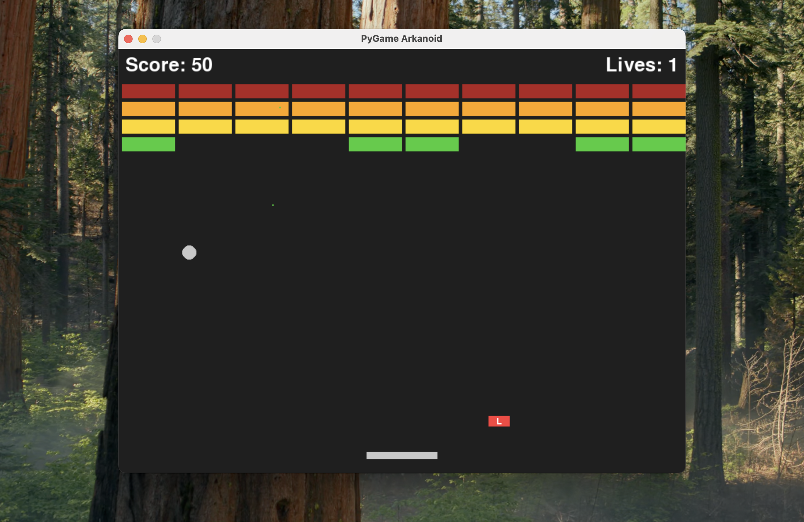

# Arkanoid Game



### Requirements

* **Python 3.12**
* **Pygame**

### Installation

1.  **Clone the repository:**
    ```sh
    git clone https://github.com/shokhruh-std/pygame-arkanoid.git
    ```

2.  **Open repository dir:**
    ```sh
    cd pygame-arkanoid
    ```

3.  **Create venv:**
    ```sh
    python3 -m venv env
    ```

4.  **Activate venv:**
    ```sh
    sh ./env/bin/activate
    ```

5.  **Install dependence:**
    ```sh
    pip install -r requirements.txt
    ```

6.  **Go to work directory:**
    ```sh
    cd ./work
    ```

7.  **Run the game:**
    ```sh
    python main.py
    ```